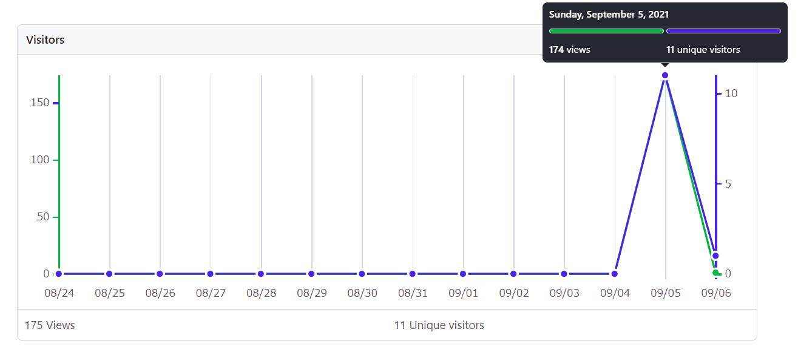
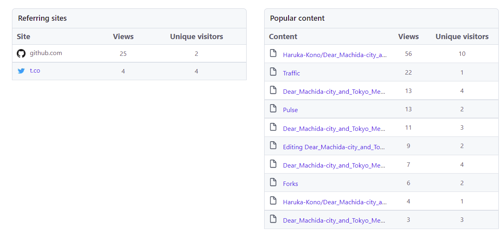

# Dear_MachidaCity_and_Tokyo_Medical_Association ～愛をこめてバリカンを～
## 東京都医師会および町田医師会の皆様へ
### ページ案内（カッコ内に、主に読んでいただきたい方々を記載してあります）
#### 【おすすめバリカンリスト】（東京都医師会および町田医師会の皆様へ）
[Recommend_BARIKAN.md](./Recommend_BARIKAN.md)がおすすめバリカンリストです。こちらをご覧ください。**これは、送付文章をきちんと読んでいただいたかの確認も兼ねております。なお、アクセス確認方法およびプライバシーに関しましては、送付文書にも記載したとおりです。下記の[本リポジトリのアクセス確認方法について](本リポジトリのアクセス確認方法について)をご覧ください。** 紹介しているバリカンについては下記の[バリカン紹介免責事項](バリカン紹介免責事項)もお読みください。

#### 組織内に属する者としての電話対応について、参考ページリスト（町田市医師会役員 広報部門のお三方、事務局の方々 ※特に、先日通話にてやり取りをさせていただいた事務局の担当者様へ）
[Telephone_Support.md](./Telephone_Support.md)に参考資料のリンクなどをリストアップしたので、上記の方々はご覧ください。**こちらについても、送付文章をきちんと読んでいただいたか確認を兼ねております。アクセス確認方法およびプライバシーに関しましては、上記の通り[本リポジトリのアクセス確認方法について](本リポジトリのアクセス確認方法について)をご覧ください。**

　町田市医師会事務局へ問合せた際、これまでに私自身がした/された電話対応を振り返ってみてもほぼ経験のないようなコメントを頂きました。経験がないのは場数が少ないからという可能性もありますが、少なくとも適切とはとても言い難い対応だったと認識しています。広報担当として電話応対をするという行為は何を意味するのか、ご理解いただければと思い参考資料を共有いたします。私自身も調べながら（広報職についているわけではありませんが）色々と勉強になりました。

### 本リポジトリの趣旨（送付した抗議文書と重複している点も一部ありますがご容赦願います）
特定個人を攻撃、誹謗中傷する意図は無く、あくまで抗議と提案が目的であることをご理解いただければと思います。
#### 趣旨1
- **理美容業界に対し「素人でもできる不要不急の商売」と結論付けてしまった町田市医師会のS先生と、彼の執筆したコラムを市の医師会報 第553号に掲載してしまった町田市医師会**（文責のS先生が特定業界へ如何なる考えを抱いていたとして、それだけでは私の立場でコメントをする権利はありません。しかし今回は、市医師会報へ執筆してしまいました。更に、会報編集過程を通り抜けてしまったことは会報編集部はじめ市医師会全体に関わる問題と考えます。また、本会報は非公開ですが、あくまで一般向けに非公開であるだけで、会員には閲覧可能な、団体としての発行物です。）

- そして、**各地区会報の中からなぜかそのコラムをセレクトし、問題の記述に修正をかけることもないまま、都医ニュース令和3年8月号 Vol.666にて公開してまった東京都医師会**（なお、町田医師会がこの転載にあたりゴーサインを出していることは確認済みです。本件に至っては両医師会とも言語道断です）

に所属されていて、かつ理美容業界を **「素人でもできる不要不急の商売」** と考えている方々に、**高性能のバリカンをご紹介する**事を1つの目的としています。

　※例えば町田市医師会には、HPによるとおよそ380名の医師が所属されているとのことですが、380/380が理美容業界に対し同様の見解を持っているとは限らないと信じ、条件分岐を設けることにしました。会名義の会報としてあのコラムが上がってしまったことで、私含め様々な方が会体質にがっかりしてしまったことは事実ですので、そこは残念ですが…。詳しい組織構成が分からないので、東京/町田市医師会に所属していながら、あのコラムを読んでも動ける立場ではなくやるせなさを覚えている方もいらっしゃるのでしょうか。もしそうでしたら、せめてもの救いであります。

　バリカンに詳しいわけではないので、とりあえず高級モデルに絞ってリストアップしています。髪の毛が伸びてきてストレスを感じているが、**不要不急で素人でもこなせる作業**を頼むために外出するのもためらわれるという、そんなジレンマを抱えた際のお供にぜひ。素人でもうまくできたかどうかなどの報告ありましたらお待ちしております。

#### 趣旨2
また、もうひとつの目的は「**電話でのやり取りは、組織に対する印象を決定づける要因として重要なものの1つ**であり、電話でのやり取りは、単なる電話でのやり取りではない（どこかで聞いた構文になってしまいましたが）」という点を**町田市医師会事務局の広報担当の方（および医師会役員の広報部門の方々）にご理解いただくこと**です。

何らかの過ちをおかしてしまう事は人生において何度も経験する事かと思います。勿論それ自体を防ぐことが大切とはいえ、過ぎてしまった以上、信頼回復の第一歩は事後対応では無いでしょうか。正直、事後対応が誠実であったならば、おそらく私は抗議文やこのようなページ作成に至っておりません。

※なお、東京都医師会の事後対応については、[理容室を「素人でもできる商売」呼ばわり　東京都医師会、物議の情報誌コラムめぐり謝罪](https://www.j-cast.com/2021/08/30419221.html?p=all)という記事、特にその最後にある、
> J-CASTニュースは30日、東京都医師会に詳しい経緯について取材で尋ねたが、「すでにホームページ上で見解は表明済みでございます」との回答だった。

を見て、個人が問合せても回答が得られないとと思い問合せておりません。町田市医師会については、表立ったコメントがなかったので問合せた次第です。しかし、東京都医師会側の取材対応や謝罪声明の文面含め、誠意が感じられない対応という印象を受けましたので、東京都医師会の事務局（広報担当）の方々にもぜひお読みいただければと思います。

### 免責事項（バリカンについて）
- [Recommend_BARIKAN.md](./Recommend_BARIKAN.md)にて紹介しているバリカンですが、特定の企業などから広告を依頼されているなどの事実は一切ございません。単に高性能そうなハイエンドモデルを並べただけです。ちなみに私の手持ちのバリカンは3,000円ほどで購入したエントリーモデルなので、リストにある製品を使用したこともございません。

- アフィリエイトなどもやっていないので、リストをもとに購入していただいても私には何の利益も入りません。私はとても親切なので、善意でご紹介させていただいております。

- 上述の通りバリカンに全然詳しくないので、ハイエンドモデルを中心に性能が良さそうなやつをピックアップしただけです。どれが良さそうとかは私もよくわかりません（といっても値段が値段なのできっといい仕事をしてくれるのではないでしょうか）。

- 紹介しているバリカンを購入された際、使用時などにトラブルがありましても、こちらでは一切責任を負いません。初期不良などについては、メーカー既定の保証内容などに従ってください。

- つまりどういう事かといいますと、あくまで、「高級バリカンをリストアップしただけ」のものです。

- 当方短髪なものでして、長い髪の方向けのおすすめグッズについては現時点でご紹介リストを作れずにいます。申し訳ございません。ただし、長髪の方でもバリカンを有効活用することはできるようです。

### 本リポジトリのアクセス確認方法について
Github標準のアクセス解析機能のみを用いています（Google Analyticsなどの外部サービスは使用しておりません）。この機能を用いてわかるのはページの閲覧数とアクセスしたユーザー数、どのページからアクセスに至ったかのみです。IPアドレスなどの情報は取得しません。参考として、アクセス解析画面を2枚示します。このような情報以外は取得できません。1枚目（ページビュー数欄上部画面）

2枚目（ページビュー数欄下部画面）

※2枚目の画像左側にある、"t.co"ですが、これはアクセス解析の動作確認用に、私が自分のTwitterアカウントにてダイレクトメッセージ（非公開のメッセージ欄）へ投稿してリンクを踏んだ結果です。ただし、私自らが公開tweetなどで拡散する予定は現時点ではありません（リポジトリのURLでTwitter検索をかけると、何も出てこないはずです）。ただ、このリポジトリは公開ページなので、何らかの形で第三者に偶然知れ渡る可能性はあります。

***

## （偶然ここにたどり着いた医師会関係者以外の方へ）
バリカンを紹介するだなんてふざけているのかと思うかもしれませんが、いいえ、むしろ大真面目であり、そして本案件には本気で怒っています。怒りによるアドレナリンがないとわざわざこのようなことをしません。特に事後対応については **「一個人が真正面から正攻法で挑み、筋の通った対応を求めてもそれは無理であること」** を実感するには十分でありました。

このリポジトリは、**正面突破を諦めざるを得なかった私なりの強い抗議方法です。** 東京都医師会HP上の声明文（[都医ニュース8月号「ふれあいポスト」について](https://www.tokyo.med.or.jp/24585)）を見ていただけると、事後対応や組織体質について私が失望したことのうちほんの僅かな部分ではありますが、なんとなくご理解いただけるかと思います。各ページはご自由にご覧下さい。

***

## 最後に
　少なくとも私にはセルフカットは難しかったですね。髪が伸びてきたものの、体調不良でほとんど外出が出来なかった数年前。手持ちのバリカンでセルフカットをやってみたのですが、非常に疲れた上に散々なことになったことがありますし。また、セルフじゃなくても理美容業が素人には難しいのを感じた機会は中学の頃にあった職場体験ですね。地元にある理容室のお世話になったのですが、ちょうど同じ班に野球部員がおり、ぼちぼち散髪タイミングとのことでしたので、バリカンで坊主にする作業を体験させていただきました、あれは本当に難しかった。虎刈りになりました。最終的にはプロの手で綺麗な坊主になり、メンバー共々感激したのを覚えています。何はともあれ、ご健闘をお祈りいたします。

　※特定職業について、どのような印象や意見を持つか。それそのものは個人の自由、対象の職種を問わず当然であることを前提として申しますが、理容業界を医師が見下すという事は、よりによって **「医師と同じく」、人体へ刃物を向けることが出来る数少ない資格保持者** の尊厳を踏みにじる行為ではないでしょうか。素人散髪の難しさを痛感しており、かつ親戚に美容師がいる身としては、尚更カチンと来ました。

 　最後に、東京都保健福祉局のプレスリリース[東京都ワクチン接種会場の開設・再編等（2349報）2021年8月16日](https://www.metro.tokyo.lg.jp/tosei/hodohappyo/press/2021/08/16/22.html)に記載された、理美容業界などに従事していらっしゃる方向けのワクチン接種案内文を引用し、このREADME.mdを締めさせていただきます（強調は筆者である私によるものです）。
  > 都は、**東京の都市活動や都民生活を支え**、人と直接接する機会の多い方を、新たに都の大規模接種の対象とします。

**Author: Haruka Kono** Last modified: 2021-09-14

<!--備考 暫定的に手持ちの研究用アカウントで作っていた本リポジトリであるが、バックアップ件プライベート用サブアカウントを作成し移行。現在に至る 9/5 -->
<!--
都医ニュース原文（個人的な参照用）
都医ニュース令和3年8月号　Vol.666　ふれあいポスト　各地区会報から
町田市医師会　佐々木 崇　「不要不急の商売は次々と潰れていく」

私は2カ月に一度、行き付けの理容院に通っている。 理容行為は3密そのものなので、新型コロナに感染する可能性を考えてしばらく様子を見ることにした。予約していたので後ろめたい気もしたが、 電話でキャン セルすることにした。コロナのためという一方的なキャンセルにも拘らず、 店主は気を回し てキャンセルを快く承諾してくれた。 心の内は分からない。 他にも断り を入れた客がいるのだろうか。 今までの付き合いがあるのに断るのは理不尽ではないかと思ってはみたが、 新型コロナに感染し、 自由が束縛されることなどを思い巡らすと致し方ないと心に決めた。
キャンセルした日から2週間が過ぎた。 新型コロナは相変わらず続 いている。 後頭部に触れると何時もより幾分髪が多いようだ。 自分で髪 を洗った後鏡を見るとさっぱり感がない。
満を持して電話をした。 「何時が良いですか」「何時でも良いです。 あっと、明日は都合が悪いです」「じゃ明後日はどうですか」「じゃ、お願いし
ます」 いつものようにはきはきとした応対である。 私がキャンセルしたことなど忘れているのか､サービス業だからそんなことはないだろう。

私は手術用手袋を装着するという重装備で椅子に座った。 彼女の方は、 マスクだけの軽装備。 いつもと変わらず、新型コロナに向かう姿勢など微塵も感じられない。 洗髪の際は、マスクや補聴器を取るように言われた。 前掛けの首の所を幾分強めに絞めたのが新型コロナへの配慮なのか。 髪を洗うのもいつもの通りである。 特段、新型コロナへの配慮など感じ られない。
「今日のお客さんは、 先生だけです。 新型コロナが怖くてお客さんはほとんど来ません。 皆、奥さんにやってもらっているのかな。 テレビの出演者の髪のボリュームが増えている」。少し高めの料金を払って店を出た。 それにしても、一日に客が一人は厳しい。 いつまで新型コロナは続くのだろう。素人でもできる不要不急の商売は次々と潰れていく。（町田市医師会報　第553号から抜粋）
-->
