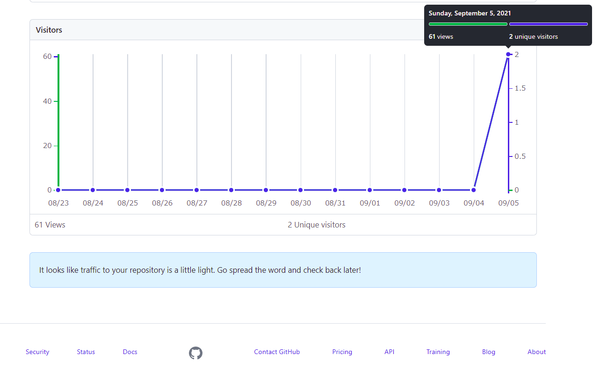

# Dear_MachidaCity_and_Tokyo_Medical_Association ～愛をこめてバリカンを～
## 東京都医師会および町田医師会の皆様へ
### ページ案内（カッコ内に、主に読んでいただきたい方々を記載してあります）
#### おすすめバリカンリスト（東京都医師会および町田医師会の皆様へ）
[Recommend_BARIKAN.md](./Recommend_BARIKAN.md)がおすすめバリカンリストです。こちらをご覧ください。**これは、送付文章をきちんと読んでいただいたかの確認も兼ねております。なお、アクセス確認方法およびプライバシーに関しましては、送付文書にも記載したとおりです。下記の[本リポジトリのアクセス確認方法について](https://github.com/Haruka-Kono/Dear_Machida-city_and_Tokyo_Medical_Association/blob/main/README.md#%E6%9C%AC%E3%83%AA%E3%83%9D%E3%82%B8%E3%83%88%E3%83%AA%E3%81%AE%E3%82%A2%E3%82%AF%E3%82%BB%E3%82%B9%E7%A2%BA%E8%AA%8D%E6%96%B9%E6%B3%95%E3%81%AB%E3%81%A4%E3%81%84%E3%81%A6)をご覧ください。** 紹介しているバリカンについては下記の[免責事項（バリカンについて）](https://github.com/Haruka-Kono/Dear_Machida-city_and_Tokyo_Medical_Association#%E5%85%8D%E8%B2%AC%E4%BA%8B%E9%A0%85%E3%83%90%E3%83%AA%E3%82%AB%E3%83%B3%E3%81%AB%E3%81%A4%E3%81%84%E3%81%A6)もお読みください。

バリカンによるセルフカットですが、調べれば色々とやり方が出てきますし、製品の取扱説明書に簡単なコツが載っている場合もあります。そのため、仕上がりを気にしないのであれば**素人でも「不可能」ではないでしょう**。ですが、「労力のいる作業である（特に後頭部）」こと、「プロに任せた時と比べた際仕上がりなどが変わってくる」点（これは特に伸びかけの状態で顕著になるかと思います。経験上）を念頭に置いてチャレンジしていただけたらと思います。調べた際、難なくセルフカットをやっているように見える動画などが出てくるかと思いますが、相当慣れている人がほとんどだと思いますし、それなりの性能を持ったバリカンなどが求められてくるかと思います。何はともあれ、一度体験してみるのもいい機会だと思います。プロのすごさを実感できるのではないでしょうか（[最後に](https://github.com/Haruka-Kono/Dear_Machida-city_and_Tokyo_Medical_Association/blob/main/README.md#%E6%9C%80%E5%BE%8C%E3%81%AB)もご覧ください）。

また、1対1での対応をしてくださるプライベートサロンもございます。プロに任せたいけど感染リスクが…という方、ぜひそういったお店の利用を検討してはいかがでしょうか（今回、特定の理美容室を宣伝する意図はありませんので、各自で調べていただければ）。

#### 組織内に属する者としての電話対応について、参考ページリスト（町田市医師会役員 広報部門のお三方、町田市医師会事務局 広報担当の方々へ ※特に、先日通話にてやり取りをさせていただいた町田市医師会務局の担当者様）
[Telephone_Support.md](./Telephone_Support.md)に参考資料のリンクなどをリストアップしたので、上記の方々はご覧ください。**こちらについても、送付文章をきちんと読んでいただいたか確認を兼ねております。アクセス確認方法およびプライバシーに関しましては、上記の通り[本リポジトリのアクセス確認方法について](https://github.com/Haruka-Kono/Dear_Machida-city_and_Tokyo_Medical_Association/blob/main/README.md#%E6%9C%AC%E3%83%AA%E3%83%9D%E3%82%B8%E3%83%88%E3%83%AA%E3%81%AE%E3%82%A2%E3%82%AF%E3%82%BB%E3%82%B9%E7%A2%BA%E8%AA%8D%E6%96%B9%E6%B3%95%E3%81%AB%E3%81%A4%E3%81%84%E3%81%A6)をご覧ください。**
町田市医師会事務局へ問合せた際、これまでに私自身がした/された電話対応を振り返ってみてもほぼ経験のないようなコメントを頂きました。経験がないのは場数が少ないからという可能性もありますが、少なくとも適切とはとても言い難い対応だったと認識しています。あまりに衝撃的な体験でしたので、私自身の認識が著しく世間と乖離している可能性と不安まで頭をよぎりました。このような経緯から、電話対応の重要性について様々な方に見解を求めたり、ノウハウが書かれたホームページを閲覧したりしました。その結果として、前述の不安は杞憂であったという認識に至りましたが、これだけですと私の主観に過ぎません。そこで、私が参考にした資料など共有させていただきます。（本ページ作成にあたり新たに調べたものや、別な調べもの中偶然見つけたものなども含んでいます。検索時は、バイアスのかかりにくい検索ワードで調べるようには心掛けました（使用した検索ワード例:「広報　電話対応」など　※「広報　組織　顔」などはバイアスがかかると考えておりますので、このようなワードでは検索をしていません）。

### 本リポジトリの趣旨（送付した抗議文書と重複している点も一部ありますがご容赦願います）
このリポジトリは、
- **理美容業界に対し「素人でもできる不要不急の商売」と結論付けてしまった町田市医師会のS先生と、彼の執筆したコラムを町田市医師会報 第553号に掲載してしまった町田市医師会**（こちらは非公開ですが、公開の有無は関係ないと考えています。あらゆる職業への敬意を著しく欠く考えを文章化して掲載することにより、内心から外へと放出してしまったことが問題ではないでしょうか）

- そして、いったい何故なのかは不明ですが、**わざわざそのコラムを各地区会報の中からセレクトしてHPに公開してまった東京都医師会**（なお、町田医師会がこの転載にあたりゴーサインを出していることを問合せで確認しております。両医師会とも言語道断です）

に所属されていて、かつ理美容業界を「素人でもできる不要不急の商売」と考えている方々に、**高性能のバリカンをご紹介する**ことを1つの目的としています。

バリカンに詳しいわけではないので、とりあえず高級モデルに絞ってリストアップしています。髪の毛が伸びてきてストレスを感じているが、**不要不急で素人でもこなせる作業**を頼むために外出するのもためらわれるという、そんなジレンマを抱えた際のお供にぜひ。

素人でもうまくできたかどうかなどの報告ありましたらお待ちしております（私からの封筒が残っているなら、そこにある住所に郵送してください）。

また、もうひとつの目的は「**電話でのやり取りは、組織に対する印象を決定づける要因として重要なものの1つ**であり、電話でのやり取りは、単なる電話でのやり取りではない（どこかで聞いた構文になってしまいましたが）」という点を**町田市医師会事務局の広報担当の方（および医師会役員の広報部門の方々）にご理解いただくこと**です。

※東京都医師会の事後対応については、[理容室を「素人でもできる商売」呼ばわり　東京都医師会、物議の情報誌コラムめぐり謝罪](https://www.j-cast.com/2021/08/30419221.html?p=all)という記事、特にその最後にある、 
> J-CASTニュースは30日、東京都医師会に詳しい経緯について取材で尋ねたが、「すでにホームページ上で見解は表明済みでございます」との回答だった。

を見て、問合せるだけ無駄だろうなと思い問合せておりません。しかし、謝罪声明の文面含め、誠意が感じられない対応という印象を受けましたので、東京都医師会の事務局（広報担当）の方々にもぜひお読みいただければと思います。

### 免責事項（バリカンについて）
- [Recommend_BARIKAN.md](./Recommend_BARIKAN.md)にて紹介しているバリカンですが、特定の企業などから広告を依頼されているなどの事実は一切ございません。単に高性能そうなハイエンドモデルを並べただけです。ちなみに私の手持ちのバリカンはエントリーモデルなので、リストにある製品を使用したこともございません。

- アフィリエイトなどもやっていないので、リストをもとに購入していただいても私には何の利益も入りません。私はとても親切なので、善意でご紹介させていただいております。

- 上述の通りバリカンに全然詳しくないので、ハイエンドモデルを中心に性能が良さそうなやつをピックアップしただけです。どれが良さそうとかは私もよくわかりません（といっても値段が値段なのできっといい仕事をしてくれるのではないでしょうか）。

- 紹介しているバリカンを購入された際、使用時などにトラブルがありましても、こちらでは一切責任を負いません。初期不良などについては、メーカー既定の保証内容などに従ってください。

- つまりどういう事かといいますと、あくまで、「高級バリカンをリストアップしただけ」のものです。

- 当方短髪なものでして、長い髪の方向けのおすすめグッズについては現時点でご紹介リストを作れずにいます。申し訳ございません。一応長髪でも

### 本リポジトリのアクセス確認方法について
Github標準のアクセス解析機能を用いています。この機能を用いてわかるのはページの閲覧数とアクセスしたユーザー数、どのページからアクセスに至ったかのみです。IPアドレスなどの情報は取得しません。参考として、アクセス解析画面を示します。
Google Analyticsなどの外部サービスは使用しておりません。
***

## （偶然ここにたどり着いた医師会関係者以外の方へ）
バリカンを紹介するだなんてふざけているのかと思うかもしれませんが、いいえ、むしろ大真面目であり、そして本案件には本気で怒っています。怒りによるアドレナリンがないとわざわざこのようなことをしません。特に事後対応については **「真正面から正攻法で挑み、筋の通った対応を求めてもそれは無理であること」** を実感するには十分でありました。

このリポジトリは、**正面突破を諦めざるを得なかった私なりの強い抗議方法です。** 東京都医師会HP上の声明文（[都医ニュース8月号「ふれあいポスト」について](https://www.tokyo.med.or.jp/24585)）を見ていただけると、事後対応や組織体質について私が失望したことのうちほんの僅かな部分ではありますが、なんとなくご理解いただけるかと思います。

***

## 最後に
少なくとも私にはセルフカットは難しかったですね。髪が伸びてきたものの、体調不良でほとんど外出が出来なかった数年前。手持ちのバリカンでセルフカットをやってみたのですが、非常に疲れた上に散々なことになったことがありますし。また、セルフじゃなくても理美容業が素人には難しいのを感じた機会は中学の頃にあった職場体験ですね。地元にある理容室のお世話になったのですが、ちょうど同じ班に野球部員がおり、ぼちぼち散髪タイミングとのことでしたので、バリカンで坊主にする作業を体験させていただきました、あれは本当に難しかった。虎刈りになりました。最終的にはプロの手で綺麗な坊主になり、メンバー共々感激したのを覚えています。何はともあれ、ご健闘をお祈りいたします。

※職業差別的言動が致命的な問題であることは、対象の職種を問わず当然であることを前提として申しますが、よりによって **「医師と同じく」、人体へ刃物を向けることが出来る数少ない資格保持者**に対しあのようなコラムを書いてしまったのはこう…なんて言ったらいいんでしょう。素人散髪の難しさを痛感しており、かつ親戚に美容師がいることもあったので、尚更カチンと来ました。素人でよければ私が切ってあげてもいいんですが上述の通り不器用なのでやめておきます。

<!--備考 暫定的に手持ちの研究用アカウントで作っていた本リポジトリであるが、バックアップ件プライベート用サブアカウントを作成し移行。現在に至る 9/5 -->
