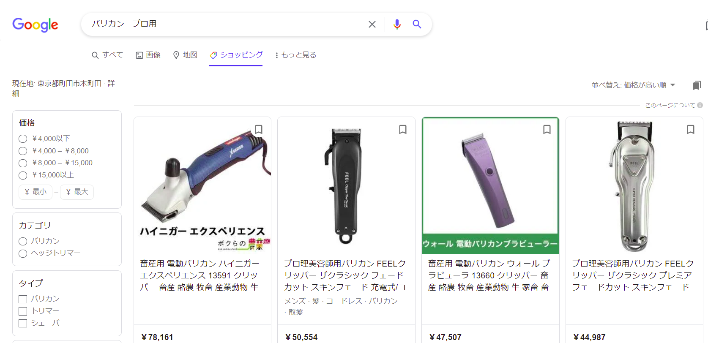

# おすすめバリカンリスト (2021年9月15日更新)
## はじめに
　このページは、セルフカットの助けになるであろう、ハイエンドモデルおよびそれに相当するレベルと思われる製品を紹介している。正直バリカンについては全くの素人だが。単なる調査結果なので、購入の際わずかでも参考になれば幸いである。それなりにしっかり調べたつもりではあるが…。とりあえず各メーカーの機種をそれぞれ1~3種類程度セレクトしている。すべてのメーカーを把握することはできていないのでその点はご了承いただきたい。

バリカンによるセルフカットについては、調べれば色々とやり方が出てくる。また、製品の取扱説明書やメーカーのHPなどに簡単なコツが載っている場合もある。そのため、仕上がりを気にしないのであれば **素人でも「不可能」ではないでしょう。**   
バリカン使用に適した髪型で、それなりのバリカン（モーター出力や刃の品質などによっては髪の毛が引っかかりやすいなどの問題もあるため、使用する製品にはそれなりのスペックが必要かと）を使い、セルフカットについて情報収集をしっかりしたうえであとは覚悟を決めて行えば、ある程度は可能と思われる (実際、調べるとセルフカットでほぼ済ませている人のブログなど出てきます。かなり慣れているであろう人も多く、「素人」と呼んでいいかは分かりませんが…セミプロ的な感じかと。)。  

ただし、「労力のいる作業である（特に後頭部）こと」、「プロに任せた時と比べた際仕上がりなどが変わってくる点」（これは特に伸びかけの状態で顕著になるかと思いますね。を念頭に置いてチャレンジしていただけたら幸いだ。

何はともあれ、一度体験してみるのもいい機会では。カットという作業は理美容業において数ある仕事のうちのひとつであるが、そのひとつを体験することは、プロのすごさを実感し、リスペクトが深まるきっかけにつながるかもしれない。

# バリカン紹介
基本的にメーカーごとにリストアップしている。**リンクは、該当商品の型番または製品名(リンクの文字列)でのGoogle検索結果である。** おそらく検索結果上部にショッピング欄が出てくるかと思うので、購入の際は適法性などご注意の上、お好きなところからご購入いただければ幸いである。また、商品については簡単な説明も添えているが、詳細はメーカーHPや販売サイトなどでご確認いただきたい。
価格情報などは、明記されていない場合基本的に9月上旬時点の物である。リンク先を参照する際はご注意頂きたい。

## プロ用（業務用）
理美容業界向けに提供されている製品ラインナップ。**「素人側がプロモデルを使いこなし、それなりのクオリティでセルフカットをすることができるのか」** という検証としては適した系なのかもしれない。  
しかし、これは当然ではあるが、基本的には我々素人が使うことは想定されていない。それゆえメーカーによってはHPの情報や販売元が限られているケースもある。  
このため、通販サイトで購入する際は、**正規ルートで仕入れたものかなどよく確認することを推奨する。**

### 安全における注意
- 使い方やメンテナンス方法が特殊だったりするので、普段取説を読まないタイプの方でも**取説は基本的に読んでから使うことを推奨する　とくに、安全上の注意点が書いてあるところ**

- 一部の製品をメーカー公式HPや各種通販サイトで調べると **「ゼロギャップ可」** という表記があるが、そこにはほとんどの場合、
>「クリッパーおよびトリマーを**ゼロギャップでご使用は調整や扱い方を間違えると大怪我となる可能性**がありますので、**未経験あるいは経験の浅い方は経験者の指導、アドバイスを受け危険を熟知した上でご使用ください**」 （[Andis日本正規代理店チャンネル ゼロギャップツール紹介動画](https://www.youtube.com/watch?v=fEfY9IFFZRc)　概要文より引用 強調は筆者注）

  **「素人でもできる」** どころか、**「素人の使い方次第では大けがにつながりかねない」製品を用いてプロは慎重に仕事をしている。**  
  ゼロギャップ化はドライバーによる調整などが必要なのでバリカン本体購入時にそうなっていることは無いが、安全面の問題から、ゼロギャップ化をすることは推奨しない。ちなみに、ゼロギャップ化とは、バリカンの上刃と下刃のズレ（ギャップ）を無くす操作である。熟練のプロが適切に調整した状態なら作れるスタイルの幅が広がるものの、刃と皮膚が直接触れるリスクがあるので初心者には大変危険な行為のようだ。

以上のことから、購入及び使用については自己責任でお願いしたい。[READMEの免責事項](https://github.com/Haruka-Kono/Dear_Machida-city_and_Tokyo_Medical_Association/blob/main/README.md#%E5%85%8D%E8%B2%AC%E4%BA%8B%E9%A0%85%E3%83%90%E3%83%AA%E3%82%AB%E3%83%B3%E3%81%AB%E3%81%A4%E3%81%84%E3%81%A6)も参照いただけると。

また、店内で使うことを想定しているので、防水機能は基本的にない。軽く濡らした髪を扱うことはほとんどのモデルでできると思われるが、浴室での使用を希望する方は後述の一般用モデルを参照いただきたい。

もう一点、プロ用の特徴を述べるとしたら、ほとんどが刈り上げやフェードカットなどへの使用を目的に作られているため（はさみの存在を考えれば当然ではあるが）、アタッチメントを含めても刈り高さがかなり短い製品が多いという事だ。アタッチメントが付属しない製品もある。  
坊主スタイルやツーブロック、スキンフェードなどにしたい方にはちょうどいいかもしれない。一方、少し長めのアタッチメントが欲しい場合は、家庭用の物が適していると思われる。  
では、以下より紹介に移らせていただく。

### Panasonic
家庭用バリカンでおなじみのメーカーだがプロ用も出している。公式HP情報は少ない上、理美容業界者向けの確認画面が出てくるが。
- [ER-GP62](https://www.google.com/search?q=ER-GP62&oq=ER-&aqs=chrome.0.69i59j69i57j69i59l2j0i131i433i512j69i60l3.3974j0j4&sourceid=chrome&ie=UTF-8)
  - 今年の9月1日、つまりつい最近発売されたモデル。オープン価格だが、調べた限り相場は19,000円程度か。
  - 小型で軽量なのがセールスポイント。本体重量は約155gで、以後紹介する製品のおよそ半分ほどである。今回紹介する製品で、100g台の物はこちらだけである。バリカン（クリッパー）としては圧倒的に軽いと言っていいだろう。
  - コード/コードレス両対応。約1時間の充電で50分程使用可能。
  - ブレード（刃）は可動刃がカーボン/固定刃がチタンのハイブリッド。おそらく、2020年に発売された後述のモデルと同じ材質かと。リニアモーターで出力の自動調節が可能な点も引き継いでいるようだ。なお、アタッチメント無しでの刈り高さは0.6mm。リニアモーターはバッテリー残量が少なくても出力が変わらないのが特長らしい。
  - 付属品は、アタッチメント(3/4mm、6/9mm、12/15mm)、アタッチメント収納ケース（何気にこれが便利かもしれない 他メーカーだとなかなか無い）、充電スタンド、ACアダプター
  - 一応メーカー公式HPにて[製品紹介のページ](https://panasonic.jp/mens/pro/products/ER-GP62.html)があるものの、「あなたはプロの理美容業界の方ですか？」と出てくる。製薬会社のHPで「あなたは医療関係者ですか？」と出てくるようなものに似ているか。

- [ER-GP82-K](https://www.google.com/search?q=ER-GP82-K&oq=ER-GP82-K&aqs=chrome..69i57j69i61j69i60j69i61&sourceid=chrome&ie=UTF-8)
  - 2020年3月1日発売。ER-GP80という製品の後継品らしい。発売当初の相場は24,000円～26,000円くらいと思われるが、現在は19,000円～20,000円ほどが多い印象。
  - 髪の量をセンサーで検知し出力を自動コントロールする。MAXは10,000spm (ストローク/分)の高出力（他メーカーだと高くても7,200spmくらいなのでこれはかなり高速なストロークだと思われる）。ブレードは可動刃がカーボン/固定刃がチタンのハイブリッドで耐久性が高いとのこと。
  - ダイヤルがついていて、アタッチメント無しでも刈り高さ0.8mmから2mmまで、0.3mm刻みでできる。この機能は驚いたが、どうやらプロ用のバリカンには似たような機能が搭載されていることが多いようだ。後述の製品にも結構該当する。メンズで流行りのフェードカット向けだろうか？
  - コード/コードレス両対応。約1時間の充電で50分程使用可能。
  - 付属品はアタッチメント3種類（3mm/4mm, 6mm/9mm, 12mm/15mm）と、充電スタンド、ACアダプター、アタッチチメント、アタッチメント収納ケース（何気にこれが便利かもしれない 他メーカーだとなかなか無い）、掃除用オイル、専用ブラシ各1個ずつ。

### FEEL JAPAN
 このメーカーは今回のバリカン調査で初めて知った。プロ用のハサミやバリカンなどを作っている国内メーカーのようだ。
- [FEEL クリッパー ザ・クラシック-プレミア2](https://www.google.com/search?q=FEEL+%E3%82%AF%E3%83%AA%E3%83%83%E3%83%91%E3%83%BC+%E3%82%B6%E3%83%BB%E3%82%AF%E3%83%A9%E3%82%B7%E3%83%83%E3%82%AF+-+%E3%83%97%E3%83%AC%E3%83%9F%E3%82%A22&oq=FEEL%E3%80%80%E3%82%AF%E3%83%AA%E3%83%83%E3%83%91%E3%83%BC%E3%80%80%E3%82%B6%E3%83%BB%E3%82%AF%E3%83%A9%E3%82%B7%E3%83%83%E3%82%AF++-+%E3%83%97%E3%83%AC%E3%83%9F%E3%82%A22&aqs=chrome.0.69i59.543j0j9&sourceid=chrome&ie=UTF-8)
  - 「アルミとステンレスで造り上げた高級感あふれるボディー」（メーカーHPより引用）が特徴。
  - Panasonic ER-GP82-Kにも似たような機能があったが、アタッチメント無しで刈り高さを0.5〜2.4mmまで調整できる（こちらは無段階とのことである。よりフェードカット向けなのだろうか）
  - 毛量に応じたパワー自動調節機能、バッテリー残量が少なくても変わらない出力が特長。これを見るに、おそらくリニアモーターだと思われる。
  - 日立金属製銀紙5という高耐久のステンレス鋼をブレードに採用。
  - メーカー設定の参考小売価格は税別で38,000円。また、各種大手通販サイトに直営店を出している。詳しくは[メーカーの製品紹介ページにて。](https://www.feelscissors.jp/clipper-premier)
  - 付属品は、アタッチメント（1.5mm,3.0mm,4.5mm,6.0mm,10mm,13mm,16mm,19mm）、充電アダプター、クリーニングブラシ、オイル。

- [BTM-P28](https://www.google.com/search?q=BTM+-+P28&oq=BTM+-+P28&aqs=chrome..69i57&sourceid=chrome&ie=UTF-8)
  - メーカー公式の商品説明ページは[こちら。](https://www.feelscissors.jp/clipper-p28)
  - BTMシリーズのハイエンドモデル。このシリーズ、なんとディスプレイがついている。調べた限りでは、FEELくらいしか業務用でディスプレイ付きの製品を出しているところを発見できなかった。バッテリー残量、モーター回転数、負荷などが表示されるらしい。
  - コード/コードレス両対応。大容量バッテリー付で、充電は3時間必要だが、フル充電で250分稼働する。また、ボタンで刈り高さを4段階(1.0mm 1.3mm 1.6mm 1.9mm)で調節可能。
  - Panasonicと似たような、髪の量をセンサーで検知しモーター回転数を自動コントロールする機能がある。5,000rpm~7000rpmまで, 500 rpmごとに調整可能（rpm=モーター回転数/分。Panasonicなどのメーカーが出しているspmはおそらく刃のストローク数。こちらはモーター回転数なので、ストローク数に直すとどうなるかは不明）。
  - ヘッド部分のみ水洗い可。
  - メーカー公式価格は税別20,0000円。
  - 付属品は、アタッチメント(3mm,6mm,9mm,12mm,15mm,18mm,21mm,25mm)、充電スタンド、充電アダプター、オイル、クリーニングブラシ。

正直、FEEL JAPANに関しては、プロ向けのメーカーにもかかわらず一般の我々も閲覧、購入が簡単にできるくらい公式HPなどが充実しているので、正直そこを見たほうが早い。バリカンについては、[clipperシリーズ（いわゆるバリカンのラインナップ）](https://www.feelscissors.jp/clipper)を参照いただきたい。※購入についてだが、[公式HP](https://www.feelscissors.jp/)最下部に、Amazon, 楽天, Yahoo!の3通販サイトへのリンクがある。各サイトに出品者登録をしているようだ。なお製品ページにある大きめのアイコンから各通販サイトに飛ぶと、公式店以外の出品者も含め結果に出てくるので、公式販売元からの購入を希望の際はよく確認して頂きたい。

### Andis
Andisはアメリカのメーカー。こちらも初耳であった。三信という代理店が正規輸入している。
製品紹介ページの多くに「ゼロギャップ可」という表記がある。ゼロギャップ化は前述の通り未経験者には危険な行為であるため推奨しない（初期設定はゼロギャップ化されていないのでご安心頂きたい）
- [マスターコードレスクリッパー](https://www.google.com/search?q=%E3%83%9E%E3%82%B9%E3%82%BF%E3%83%BC%E3%82%B3%E3%83%BC%E3%83%89%E3%83%AC%E3%82%B9%E3%82%AF%E3%83%AA%E3%83%83%E3%83%91%E3%83%BC&oq=%E3%83%9E%E3%82%B9%E3%82%BF%E3%83%BC%E3%82%B3%E3%83%BC%E3%83%89&aqs=chrome.1.69i57j35i39l2j69i59j0i512j69i61l3.6069j0j9&sourceid=chrome&ie=UTF-8)
  - 正確には。マスター🄬 ないしMaster🄬表記にする必要があるが、検索時は除外したので上記の文字列になっている
  - コード/コードレス対応。充電60分で約90分使用可。
  - 本製品の設定価格は40,000円以上だが、通販サイトによっては35,000円くらいになっている。
  - アルミボディにカーボン製ブレード（刃）。ロータリーモーターの出力は固定で7,200 spm [注釈1](https://github.com/Haruka-Kono/Dear_Machida-city_and_Tokyo_Medical_Association/blob/main/Recommend_BARIKAN.md#%E6%B3%A8%E9%87%881)。刈り高さは0.5mm～2.4mmの無段階調整機能付き。アタッチメントは無し。
  - 付属品は電源アダプター、プレミアム充電スタンド、ブレードオイル。
  - なお、どういうわけかあらゆる販売サイトが型番を勘違いしており、”[12480MCL andis](https://www.google.com/search?q=12480MCL+andis&oq=12480MCL+andis&aqs=chrome..69i57j35i39j69i61l3.7857j0j9&sourceid=chrome&ie=UTF-8)”で検索してもそれなりの数がヒットする（正確にはMCLではなくMLC）。型番が似ているだけで別製品なのかと思ったが、画像を見たら普通にMLCと書いてあった。購入の際、価格等を比較するにはご注意を。

- [T-アウトライナー 74005ORL](https://www.google.com/search?q=T-%E3%82%A2%E3%82%A6%E3%83%88%E3%83%A9%E3%82%A4%E3%83%8A%E3%83%BC+74005ORL&oq=T-%E3%82%A2%E3%82%A6%E3%83%88%E3%83%A9%E3%82%A4%E3%83%8A%E3%83%BC+74005ORL&aqs=chrome..69i57j35i39j69i59j69i61l3.409j0j9&sourceid=chrome&ie=UTF-8)
   - これはバリカンというよりシェーバー、トリマーというカテゴリになってくるものなのかもしれない。ただ、動画などをみるに髭剃りという意味合いのシェーバーというよりかは、襟足やキワの部分を整える意味合いが強そうだ。要するに、細かい部分の調整用。
   - 上記の事もあり、**本製品単体での使用というよりは、通常のバリカン（クリッパー）と併用することが前提になりそうである。**
   - 執筆時点（2021.9月8日）での相場は30,000円前後といったところか。
   - コードレス。60分の充電でおよそ100分間使用可。また、バッテリー残量を知らせるLEDライトがついている。
   - 日本正規輸入版はステンレスブレード。米国版はカーボンブレード。仕様の違いに注意。刈り高さは0.25mm固定だが、付属のアタッチメントで調整可能。
   - 付属品はアタッチメント4種類（ 1.55mm / 3mm / 6mm / 10mm ）、電源アダプター、プレミアム充電スタンド。ブレードオイル、ブラシ。

なお、Andisも日本版の製品情報が[公式HP](https://andis.co.jp/)にて一通り記載されている。昨年の製品カタログは[こちらのPDFファイル **（全8ページなのだが、画像が多いためかサイズが27MBほどあるご注意を）**](https://andis.co.jp/product-documentation/catalogs/andis-productsheet-catalog-202003-01-jp-01.pdf) 。clipperがいわゆるバリカンに相当するシリーズである。実はこのカタログのどこかに面白い誤植がある。お時間があればぜひ探してみていただきたい。

プロ用のメーカーはあと2つ紹介させていただく。それぞれ国内外の老舗メーカーである。

### WAHL
バリカンの歴史を調べていたら、電動バリカンのパイオニアとのことで合った。その歴史は100年以上。1919年、世界初の電動バリカンを作ったのがここだ。日本向けのプロダクトもあり、なかなかコンセプトが面白いので1つ紹介させていただく。なお、今回紹介するモデルは検索にあまり引っかからないので、製品名のところにあるリンクは公式HPの物となっている。そちらから購入が可能だ。

- [Carp clipper](https://www.wahl.co.jp/professional/clipper/special_edition_carp_clipper/)
  - ~「野球（特定球団）と宗教と政治の話はタブー」という概念を破る点お許しいただきたい。~ 他球団がやっていないもので…。自分の贔屓がやってたら迷わず買ってしまいそうである。どこのファンかは内緒です（これを紹介するという事は11球団に絞られますけど）。気になる方は個別に聞いてください。
  - まさかのプロ野球チームとのコラボ品である。ここまで様々なプロ用バリカンを調べていて、数々の機能や要素に驚かされてはきたが…まさか球団公認バリカンとは。鯉党の方は是非。また、広島県内の理美容院でならお目にかかれるのかもしれない。
  - 価格は、税別18,500円（税込20,350円）。限定モデルなので、アクセス時点で在庫があるかどうかは不明な点ご了承いただきたく思います。2021-9-15 19:52時点では50Hz/60Hz両方在庫残り僅かでした
  - 刈り高さは約1.0-3.0mm（無段階調整式）
  - コード付。**50Hzまたは60Hz専用であり、互換性はない。つまり別製品扱いになるので、購入の際にはよく確認を。**
  - 付属品は、アタッチメント（3.0/6.0/10/13/16/19/22/25mm）、クリッパーコーム、刃カバー、オイル+クリーニングブラシセット、取説（保証書込み）※これまで公式HPに付属品として書かれている物以外とりわけ明記していなかったが大体の製品には取説がついている。

そのほか、[公式HP](https://www.wahl.co.jp/professional/)にはコードレス製品や、100周年記念のフルメタルモデルなどさまざまな製品がある。東京オリパラ開催にあたり作られた限定モデルなどもあるが、医療従事者の方々が今回の開催についてどうお考えかなど含めるとデリケートな話題かと思い、上記のような形式で取り上げることは見送った。気になる方は、上記リンクにアクセスし、ページ上部にある`clipper`タブから`Special Edition`へ行き、該当製品のページをご覧になって頂きたい。

### THRIVE
業務用バリカンの紹介はこちらのブランドで締めさせていただこうと思う。THRIVE（スライブ/スライヴ）は、大東電気工業のヘルスケア部門におけるブランド名。ロデオボーイを出しているのがここ。バリカンについては国内でも老舗中の老舗とのことである。
。ペット用も含め様々なラインナップがある。[詳しくはメーカーHPを参照されたい。](https://daito-thrive.co.jp/hairclipper/)※誤ってペット用を買わないようにご注意を（普通に使える可能性もあるが保証しない）。今回は業務用バリカンロングセラーを紹介。
- [スライブ 5500](https://www.google.com/search?q=%E3%82%B9%E3%83%A9%E3%82%A4%E3%83%96+5500&oq=%E3%82%B9%E3%83%A9%E3%82%A4%E3%83%96+5500&aqs=chrome..69i57j69i61l2.7868j0j4&sourceid=chrome&ie=UTF-8)
  - おそらく、THRIVEと言えばこのバリカンが代名詞的存在と思われる。昔ながらの床屋さんなどで見かけることもあるのではないだろうか。ザ・バリカンと言っても過言ではないロングセラーモデル[注釈2](https://github.com/Haruka-Kono/Dear_Machida-city_and_Tokyo_Medical_Association/blob/main/Recommend_BARIKAN.md#%E6%B3%A8%E9%87%882)である。このモデルを維持している点で、WAHLよりTHRIVEをトリに選択した。調べると本体（刃の部分を除いた主要部分）を10年以上使っている人なども出てくるので耐久性も良さそうだ。
  - 現在の正式販売名は「ヘアークリッパー MODEL 5500-H」
  - 通常仕様では、チタンコーティングの下刃に2mmの上刃がついている。出力は約21,000spm
  - 標準価格は27,028円(税抜価格 24,571円)。[メーカーの製品紹介ページから直接購入も可能](https://daito-thrive.co.jp/clippers_b/detail_397.php)。付属品は、オイル、ブラシ、取説（保証書付）（コードレス非対応なのでアダプターは本体直結）。
  - 替刃は別売りである。[MODEL 5500-H用オプション](https://daito-thrive.co.jp/clippers_b/detail_397.php#:~:text=%E3%81%AF%E3%82%A4%E3%83%A1%E3%83%BC%E3%82%B8%E3%81%A7%E3%81%99-,MODEL%205500-H%E7%94%A8%E3%82%AA%E3%83%97%E3%82%B7%E3%83%A7%E3%83%B3,-%E2%96%A0%E6%9B%BF%E5%88%83%EF%BC%88%E9%98%B2)のページを参照されたい。0.1mmから16mmまで14種類ある。刃の種類によってコーティングや価格が変わってくるので要注意。全て揃えると相当なお値段になる。また、0.1~2mmまでの刃に対応したアタッチメントや替刃立てもあるが、これについては価格などがないので少なくともメーカーHPから直接入手する方法は不明である。
  - このように、刈り高さを変える際は刃ごと交換するというなかなか特殊な仕様である。おそらく昔からのスタイルなのであろう。製品の耐久性はかなり評判がいいので、決まった長さでの刈り上げを行う人などに向いていそうだ。
  - なお、刃がすり減ってきたら有料で研ぎなおしてもらえる。職人技である。

## 一般用（家庭用）
家庭用バリカンの中でも、高級モデルの場合8,000円~10,000円ほど、あるいはそれをこえてくる場合もある。お馴染みの？メーカーを中心にいくつか紹介させていただく。

なお、家庭用は基本的にメーカー公式HPや家電量販店オンラインストアなどで情報を見つけやすいこともあり、プロ用と比較して説明がやや簡潔になってしまうあるいは紹介メーカーが少なくなる可能性をご了承いただければと思います。~決して、決して業務用バリカン調査で思ったより体力を使ったからなどではございません。~

### Panasonic
家庭用バリカンといえばPanasonicというイメージの方も結構いらっしゃるのではないだろうか。カットモードシリーズ（ナショナル時代から存在する、かつてでいうところのスキカル。余談だがスキカルは実家にあった。今でもバリカンと聞くとスキカルを思い起こす。）など多様なラインナップがあるが、ミドル～ハイエンドに絞って紹介。
カットモードなど含めたメーカー公式HPはこちら。[家庭用散髪器具-Panasonic](https://panasonic.jp/haircut/)セルフカット用はヘアカッター（電動バリカン）のカテゴリである。

- [ER-SC60](https://www.google.com/search?q=ER-SC60-S&oq=ER-SC60-S&aqs=chrome..69i57j69i61l3&sourceid=chrome&ie=UTF-8) （メーカーの製品紹介ページは[こちら](https://panasonic.jp/mens/products/hair/er-sc60.html)）
  - 2017年発売モデル。オープン価格。通販だと13,000円～17,000円程。4年前のモデルだが家庭用としてはメーカーで最高級モデル。
  - Panasonicの家庭用バリカンで唯一リニアモーターを搭載しているため（なお、当時の家庭用バリカンとしては業界初のリニアモーター採用らしい）。内刃のストローク数は9,800 spm。リニアモーターならではの高出力。
  - 1時間充電で約60分使用可能
  - 刈り高さはアタッチメント無しで0.5mm。また、アタッチメントをつけると、ダイヤルでアタッチメントを動かし刈り高さが調整できる。アタッチメントAなら1~10mmまで、Bなら11~20mmまでを0.5mm刻みで調節できる。
  - 水洗い可能。家庭用ならではか。
  - 付属品は刈り高さアタッチメントA（1～10mm）, 刈り高さアタッチメントB（11～20mm）, 充電スタンド, ポーチ, 専用オイル, 掃除用ブラシ。

- [ER-GC75](https://www.google.com/search?q=er-gc75&oq=er-gc75&aqs=chrome..69i57j0i512l9.401j0j9&sourceid=chrome&ie=UTF-8)（こちらは[メーカーによる製品紹介ページ](https://panasonic.jp/mens/products/hair/er-gc75.html)）
  - おそらく上記製品の後継モデルに近い位置づけかと思われる
  - 8,000円から9,000円程が相場かと。
  - ダイヤル調整可能な刈り高さアタッチメントの他に、毛先を自然にするナチュラルアタッチメントが追加された。刈り高さは、ER-SC60同様、直刃で0.5mm, アタッチメントAなら1~10mm、アタッチメントBなら11~20mmまで0.5mm刻みで調節できる。
  - また、従来より刃の構造が変わっているらしく、刈り残し低減の効果があるとのこと。
  - 水洗い可。刃を外さずに毛くずの処理ができる「ウォータースルー洗浄」機能。
  - 付属品は、刈り高さアタッチメントA(スライド式)(1～10mm)、刈り高さアタッチメントB(スライド式)(11～20mm)、ナチュラルアタッチメント、ポーチ、オイル、掃除用ブラシ。

- [ER-GS61](https://panasonic.jp/mens/products/hair/er-gs61.html)
  - 価格は6~7,000円程。ミドルエンドだが、ボウズ専用（メーカー公式表記は「ボウズカッター』）という点が面白かったので採用。
  - シャンプーしながらカットできる。当然丸洗い可能。というか、風呂場で使うことを前提としている。（普段から坊主の人がメンテナンスをすることを想定していると思うので毛くずはかなり短いと思うが、それでも髪の毛である以上排水溝に影響はないのだろうか）
  - 刈り高さは直刃で0.5mm。1mmの固定アタッチメントと、2~10mmのスライド式アタッチメント（1mm単位でスライド可能）が付属しているので、それなりに調整は利く
  - 付属品は、1mmアタッチメント、刈り高さアタッチメント(スライド式)、ACアダプター、専用オイル、掃除用ブラシ。

- [ER-GC74](https://www.google.com/search?q=ER-GC74&oq=ER-GC74&aqs=chrome..69i57j69i60&sourceid=chrome&ie=UTF-8)
  - これまでかなり短めの刈り上げに適したバリカンばかり紹介してきたので、やや長めのスタイルに対応した製品をここでひとつ。
  - 価格は7~8,000円程度かと。
  - 直刃の刈り高さは0.5mm。アタッチメントが3種類あり、上述の製品たち同様ダイヤルで調整できる。調整単位は1mm。最長45mmまで対応。比較的長めのアタッチメントがあるので髭のスタイリングにも対応しているとのこと。
  - 丸洗い可能
  - 付属品は、アタッチメントA(1～5mm)、アタッチメントB(6～25mm)、アタッチメントC(26～45mm)、オイル、掃除用ブラシ。
  - もう少し長めのアタッチメントがある製品としては、セルフカット向けではなく水洗い不可だが[カットモード毛くず吸引 ER511P(メーカーHP)](https://panasonic.jp/haircut/p-db/ER511P.html)がある。80mmまで対応。

### Philips
髭剃り等でお馴染み。バリカンもいくつか出している。
以下、今年発売されたモデルを1つ紹介する。
- [HC5632/17](https://www.google.com/search?q=HC5632%2F17&oq=HC5632%2F17&aqs=chrome..69i57j69i59j0i512l3j69i58j69i61l2.772j0j9&sourceid=chrome&ie=UTF-8)
  - 現行の製品ではこちらがハイエンドモデルのようだ。メーカー設定価格は、[製品紹介ページ](https://www.philips.co.jp/c-p/HC5632_17/hairclipper-series-5000-washable-hair-clipper)にある各オンラインストアのリンクを見る限り7,920円。
  - 通常モードに加え、高出力のターボモードを搭載。毛量の多い場合に使うことが出来る。
  - 刈り高さは直刃で0.5mm。ツーブロック用2mmアタッチメント、刈り高さ調整アタッチメント2種類（3mm～28mmを1mm刻みで調整可能）付
  - 丸洗い可能。また、上刃と下刃が自己研磨するのでオイル差しが不要。メンテは楽である。
  - 付属品は、クリーニングブラシ、ツーブロックコーム（
  アタッチメント）、スキ刈りコーム、ヘアートリミング用コーム 2 種類（刈り高さ調整アタッチメント）、ソフトポーチ。

Philipsについては、フラッグシップモデルと思しきものが数年前に廃盤になっているのが残念である。例えば[HC9450/15](https://www.philips.co.jp/c-p/HC9450_15/hairclipper-series-9000-hair-clipper-with-motorized-combs)（直刃3種類のアタッチメントを使い分けることで1～42mm まで411段階の長さ調整が出来る上、コームごとに最大 3種類の刈り高さ設定が記憶できるなどの謎スペックぶり。家庭用としてはオーバースペックなのは否めない。ただ、こういう変態的な製品を紹介するのもまた面白いのだが…。）など。  
それらについて、現在では正規価格がいくらだったか不明。一応出回ってはいるが…価格の幅がかなり広い。中古品がプレミア化しているような現象も観測できた。ルートの正当性などが分かりかねるので購入は非推奨（どうしてもという場合自己責任で）。  
上で紹介したHC5632/17など、メーカーHPにてオンラインストアのリンクが張られている製品は現行モデルなので入手は容易である。

## おまけ
Google検索をすると、検索結果の上部に、`すべて` `画像` `動画` などとともに `ショッピング` というタブが出てくることがある（下記）

このショッピング欄にて、
「バリカン プロ用」と検索し、[価格の高い順に並び変えた結果がこちらです（2021年 9月7日 16:55時点）](https://www.google.com/search?q=%E3%83%90%E3%83%AA%E3%82%AB%E3%83%B3%E3%80%80%E3%83%97%E3%83%AD%E7%94%A8&biw=1280&bih=587&tbm=shop&sxsrf=AOaemvIr4h-5ilNcLEje5DsNxnhjQ1iDHg:1630999088767&tbs=p_ord:pd&ei=MBI3YbCfLoyb-Aaak57oBA&ved=0ahUKEwiw98GKqezyAhWMDd4KHZqJB00Quw0IngYoAg)
アクセス時点では検索結果が変わっているかもしれないので、スクリーンショットも参照。

1位に突然の畜産用バリカン。お値段は8万円弱（サイトによって7万強くらいだったりもしますが）。検索ワードを考えると頭髪用が出てくると思っていたので不意打ちで驚いた。値段もやはりそれなりにする（ただ、人間の頭髪用が4万とかいくのを考えると、安いほうなのかもしれない。さすがに畜産用までは調べる時間と体力がなかったので分かりかねるが）。

「バリカン　畜産」などで調べれば確かに上記のような結果が得られるのかもしれないが、「バリカン　プロ用」でまさかこれが出てくるとは思わなかった。余談だが、せっかくなので共有させていただく。

## 最後に
セルフカットの感想を是非お待ちしています。文書に連絡先が書いてあるので。そちらに送っていただければ。  
　もし思ったより難しくて心が折れた場合は、潔くプロに任せましょう。保健所のチェックもあるので、おおむね基本的な対策がなされている店がほとんどかと思う（それが物足りなく感じるのであれば、保健所と話し合っていただくしかない）ので。気分転換も兼ねて、換気で店内が寒くなる前にリフレッシュをするのも大切ではないでしょうか。  
　また、案外簡単にできたという場合も是非ご報告ください。未経験あるいはほとんど経験なしでしっかり仕上げられたとしたらかなり上手だと思います。**ただ、それをもって理美容業を「素人でもできる」と判断なされるのだけはご遠慮いただきたく思います。** 冒頭でも述べましたが、カットという作業は理美容業において数ある仕事のうちのひとつであり、他にもさまざまな仕事がありますし、自分の髪だけをカットするのと、様々な人の要望に応えるのとではまたカットの難易度も変わってきます。

ちなみに、結構しっかり調べたためこちらもバリカンが欲しくなってきました（基本的にプロのお世話になっているのですが、刈り上げのメンテナンスなどに使えるかなと思いまして）。特にFEEL社のクリッパー ザ・クラシックはデザインがカッコいい。アルミボディって良いですね。ついワクワクしてしまいます。尤も、私の所得ではあの価格帯のバリカンには手を出せませんが…（ある人に「欲しい」と言ったら、「高いのを買ってもどうせ不器用で使いこなせないしお店に任せなさい」と一蹴されました）。
という事で、買っていただけませんか？ **（注: 念のため言いますが、色々な意味で問題があると考えられるので、冗談ですよ。利害関係者に現時点で該当する可能性は低いですが、それ以外にもいろいろと倫理規定などあると思われるので）**

#### 注釈1
メーカーのページには、7,200rpmの「高速回転モーター」と書いてあった。spmはあくまで一分当たりのストローク数であり回転数ではないはずなのだが、一般的な工業用語とバリカンのspmは意味合いが違ってくるのだろうか。詳細は不明である。
#### 注釈2
と言っておいてなんだが、初めてこの製品を知った。業務用バリカンには本当に疎いことを痛感。調査過程で業界やユーザーの評判、公式HPのセールスポイントを見ての印象である。

**Author: Haruka Kono**  
**Last modified: 2021-9-15**
